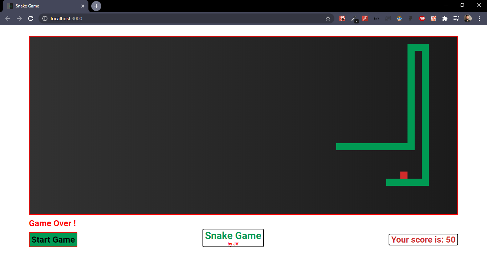

<h2 align="center">
  Snake Game using React
</h2>

</br>

<h1 align="center">
  
</h1>

## :computer: About

The project/game was based on tutorial provided by [Weibenfalk](https://github.com/weibenfalk/react-snake-starter-files). </br>
In addition to original tutorial I put some basic styling, made logic to avoid collision with the walls and put a counter to have the score. </br>
Not the most complex project, but it's an entertaining one on which you can see, practice Hooks and some spatial notion. For sure it worths the time. </br>

It is deployed on Netlify and you can check [here](https://snakegamejvictor.netlify.app/).

## How to install and run:

</br>

<strong>1. Clone this project and install dependencies</strong>

```
$ git clone https://github.com/jvictor-am/Snake-Game-React.git
$ cd Snake-Game-React
$ npm install
or
$ yarn install
```

<strong>2. Run on localhost:3000</strong>

```
$ npm start
or
$ yarn start
```

</br>

---

# LinkedIn

[**João Victor**](https://www.linkedin.com/in/jo%C3%A3o-victor-de-andrade-mesquita-848a09122/)

<h2 align="center">
  Thank You!
</h2>
